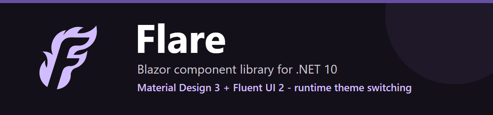

<p align="center">
  <a href="https://flare.frigat.duckdns.org/">
    
  </a>
</p>

# Flare - Blazor Component Library

<p align="center">🌐 <b>English</b> · <a href="README.ru.md">Русский</a></p>

[](https://github.com/jrfrigat/Flare/actions/workflows/ci.yml)
[](https://www.nuget.org/packages/Flare.Blazor/)
[](https://www.nuget.org/packages/Flare.Blazor/)
[](https://dotnet.microsoft.com/)
[](LICENSE)
[](https://flare.frigat.duckdns.org/)

A production-ready, **theme-agnostic** Blazor component library - **.NET 10**-first, also targeting **.NET 8 and .NET 9** - with **zero baked-in styling**. Build your own design system with semantic tokens, or start instantly with one of seven production-ready preset themes (Material Design 3 Expressive, Material Design 3, Material Design 2, Fluent UI 2, Aero, Liquid Glass, Visual Studio 2026), all shipped as independent, optional packages. Runtime theme switching, no page reload, no flash of unstyled content.

**[Live demo / component gallery ->](https://flare.frigat.duckdns.org/)**

**100+ components - build your own theme with semantic tokens - 7 optional preset design systems x 34 palettes (+ Dynamic Color) x light/dark/auto - zero third-party CSS dependencies - Docker-ready Gallery**

---

## Features

- **100+ production-ready components** across inputs, layout, navigation, data display, feedback, and utilities
- **Three independent theme axes** - swap the design system (MD3 Expressive / MD3 / MD2 / Fluent UI 2 / Aero / Liquid Glass / Visual Studio 2026), the color palette, and light/dark/auto separately, at runtime
- **Seven design systems, shipped as independent packages** - reference only the themes you use; the umbrella `Flare.Blazor` package ships no themes of its own
- **Class-toggle delivery** - switching is a class swap on `<html>` (no per-switch CSS-var injection); `ThemeDelivery.Inject` available as a fallback
- **Reusable palettes & generators** - built-in Material/Office/Aero/Liquid Glass/Visual Studio palettes (34 in total), plus `Palette.FromColors(id, name, seed)` to derive a full light+dark palette (MD3 tonal / Fluent ramp per active theme)
- **Dynamic Color** - opt-in palette derived at runtime from the OS/browser accent color (Windows/macOS accent, Android Material You via the CSS `AccentColor` system color) through the active theme's generator; falls back to a curated `DynamicFallbackPalette` where the real accent is unavailable - notably Chrome/Edge, which return a fixed placeholder, not the genuine accent (`opts.UseDynamicPalette = true`)
- **Auto dark mode** - `ThemeMode.Auto` tracks `prefers-color-scheme`; a one-line bootstrap script kills the FOUC before first paint
- **Unified color API** - one `Color` parameter (`FlareColor`) on every color-aware component: pass a semantic role (`FlareColor.Primary`) for a cached theme class, or any custom value (`FlareColor.Custom("#E91E63")`) for inline tokens
- **Expressive Slider** - MD3 Expressive + Fluent in one component: sizes XS-XL, range mode (two handles), vertical orientation, step indicators, value bubble, start/end icons, and a custom fill anchor (`Init`)
- **SVG charts** - line, bar, pie, and donut rendered with theme colors, hover tooltips, and a legend (no chart dependency)
- **Nested navigation** - nav groups can nest, and auto-expand the whole chain when a child link becomes active
- **XML IntelliSense** - every `[Parameter]` on every component has a `/// <summary>` doc comment
- **Full EditContext integration** - form validation with `DataAnnotationsValidator` out of the box
- **Advanced DataGrid** - multi-sort, column resize, row selection, inline editing, CSV export, grouping, virtualization
- **Blazor Server - WASM - SSR** compatible - JS interop calls are guarded against prerender
- **No Bootstrap / no third-party CSS** - all styles use `var(--flare-*)` tokens exclusively
- **Docker-ready** - single `docker compose up --build` serves the Gallery PWA via nginx

---

## Quick Start

```sh
dotnet add package Flare.Blazor
```

Flare ships no themes of its own - each design system is an independent `Flare.Theme.*`
package. Reference the ones you want and register them:

```sh
dotnet add package Flare.Theme.MaterialDesign3Expressive
dotnet add package Flare.Theme.FluentUI2   # add any of the other theme packages you need
```

**`Program.cs`:**
```csharp
using Flare.Extensions;
using Flare.Theme.MaterialDesign3Expressive;
using Flare.Theme.FluentUI2;

builder.Services.AddFlare(opts =>
{
    opts.DefaultTheme = new Md3Theme();        // design system (a theme = design tokens)
    opts.DefaultPalette = Md3Palettes.Violet;  // colors (a palette carries light + dark)
    opts.DefaultMode = ThemeMode.Auto;         // Light / Dark / Auto
});

// Register every other theme you want selectable at runtime. AddFlareTheme also forces the
// theme assembly to load, which a bare reference does not in a trimmed/WASM app -- so prefer
// it over relying on FlareOptions.RegisterAllBuiltInThemes auto-discovery. Each theme brings
// its own palettes via ITheme.Palettes.
builder.Services.AddFlareTheme(new Fluent2Theme());
```

**`index.html` / `App.razor` `<head>`:**
```html
<!-- One line: sets theme classes + an anti-FOUC splash before first paint -->
<script src="_content/Flare.Components/js/flare-bootstrap.js"></script>
<!-- Component styles -->
<link rel="stylesheet" href="_content/Flare.Components/css/flare-components.css" />
<!-- Material Symbols icon font (optional but recommended) -->
<link rel="stylesheet" href="https://fonts.googleapis.com/css2?family=Material+Symbols+Rounded:opsz,wght,FILL,GRAD@20..48,100..700,0..1,-50..200" />
```

**Wrap your app:**
```razor
<FlareThemeProvider>
    <Routes />
</FlareThemeProvider>
```

---

## Runtime Theme Switching

Three independent axes, switched at runtime:

```razor
@inject IThemeService ThemeService

await ThemeService.SetThemeAsync("fluent2");        // design system
await ThemeService.SetPaletteAsync("fluent-blue");  // colors
await ThemeService.SetModeAsync(ThemeMode.Dark);    // Light / Dark / Auto

// read the current selection
var theme = ThemeService.CurrentTheme;
var palette = ThemeService.CurrentPalette;
var isDark = ThemeService.IsDark;
```

**Auto dark mode** is built in: with `ThemeMode.Auto`, `FlareThemeProvider` tracks the OS
`prefers-color-scheme` and the bootstrap script applies it before first paint.

---

## Color API

Every color-aware component takes a single `Color` parameter of type `FlareColor`:

```razor
@* Semantic role -> shared, cached theme class (theme-aware, accessible) *@
<FlareButton Color="FlareColor.Primary">Primary</FlareButton>
<FlareProgress Color="FlareColor.Success" Value="70" />

@* Custom value -> inline CSS tokens (sanitized) *@
<FlareSlider Color="FlareColor.Custom("#E91E63")" @bind-Value="_v" />
```

Implicit conversion from `string` also works (`Color="@Colors.Primary"`). Roles map to
`--fc-main / --fc-on / --fc-container / --fc-on-container` tokens; components read only the
subset they need, so MD3 and Fluent stay in sync automatically.

---

## Docker

Run the published Gallery image from GitHub Container Registry (easiest):

```sh
docker run -p 8080:80 ghcr.io/jrfrigat/flare-gallery:latest
# -> http://localhost:8080
```

The image is versioned independently from the NuGet packages (tags `gallery-v*`, e.g.
`ghcr.io/jrfrigat/flare-gallery:0.0.1`).

Or build it from source:

```sh
docker build -f samples/Flare.Gallery/Dockerfile -t flare-gallery .
docker run -p 8080:80 flare-gallery
# -> http://localhost:8080
```

`docker compose up --build` uses the same `samples/Flare.Gallery/Dockerfile`, but the bundled
`docker-compose.yml` attaches the container to an external `proxy_network` for a reverse-proxy
deployment (no host port published) - add a `ports:` mapping to reach it directly.

The multi-stage `Dockerfile` produces an `nginx:alpine` image serving the static, pre-compressed
(brotli/gzip) Blazor WASM output.

---

## Components

| Category | Count | Key Components |
|----------|------:|----------------|
| **Inputs** | 18 | Button, Input, Checkbox, Switch, Radio, Select, Autocomplete, DatePicker, TimePicker, DateRangePicker, NumericField, Slider (single + range), Rating, FileUpload, ColorPicker, TagInput, InputMask, FormBuilder |
| **Layout** | 11 | Stack, Grid, Col, Container, Hidden, Layout, LayoutAppBar, LayoutDrawer, LayoutContent, Card, Divider |
| **Navigation** | 11 | AppBar, NavMenu, NavGroup, NavLink, Tabs, Tab, Accordion, Breadcrumb, Pagination, Stepper, Drawer |
| **Data Display** | 14 | DataGrid, Column, Table, VirtualList, InfiniteScroll, TreeView, DataTree, List, Timeline, Chart, Calendar, Kanban, Transfer, Carousel |
| **Feedback** | 9 | Dialog, DialogProvider, MessageBoxProvider, Alert, Snackbar, Progress, Skeleton, Tooltip, Overlay |
| **Display** | 9 | Typography (FlareText), Avatar, Badge, Chip, Icon, Image, Link, Popover, ScrollTop |
| **Utilities** | 5 | Menu, MenuItem, SpeedDial, SpeedDialAction, DropZone, RichTextEditor |
| **IDE** *(separate package)* | 6 | Ribbon, DocumentTabs, ToolPanel, Splitter, StatusBar, MenuBar |

---

## Architecture

```
Flare.Abstractions      <- ports (ITheme, I*Service), design-token model, CSS name registry (dependency-free)
Flare.Theming           <- theme engine: ThemeService, palette generation, ColorMath, token->CSS
Flare.Infrastructure    <- browser/host adapters: JS interop, storage, dialog/snackbar/messagebox
Flare.Components        <- core UI components + wwwroot/css (global token-driven bundle)
Flare.Blazor (Flare)    <- composition root: AddFlare binds ports -> adapters
Flare.Components.Carousel        <- Carousel
Flare.Components.Kanban          <- Kanban board
Flare.Components.Transfer        <- Transfer (dual list)
Flare.Components.QrCode          <- QR code
Flare.Components.RichTextEditor  <- Rich text editor
Flare.Components.Media           <- SignaturePad, VideoPlayer, FileUpload
Flare.Components.IDE             <- IDE layout: Ribbon, DocumentTabs, ToolPanel, Splitter, StatusBar, MenuBar
Flare.Theme.MaterialDesign3Expressive <- MD3 design tokens + Material palettes + tonal generator
Flare.Theme.MaterialDesign3 <- baseline MD3 (non-Expressive); shares the MD3 color system
Flare.Theme.MaterialDesign2 <- Material Design 2 design tokens + palettes + ramp generator
Flare.Theme.FluentUI2   <- Fluent UI 2 design tokens + Office palettes + ramp generator
Flare.Theme.Aero        <- Aero design tokens + palettes + ramp generator
Flare.Theme.LiquidGlass <- Liquid Glass design tokens + palettes + ramp generator
Flare.Theme.VisualStudio <- Visual Studio 2026 design tokens + palettes + ramp generator
Flare (umbrella)        <- AddFlare()/AddFlareTheme() DI extensions, LocalStorageThemeStorage (depends only on Flare.Components)
```

> Themes ship as independent packages - the umbrella `Flare.Blazor` package references **no** theme,
> so apps pull in only the design systems they use. The optional component families (`Carousel`,
> `Kanban`, `Transfer`, `QrCode`, `RichTextEditor`, `Media`, `IDE`) are likewise separate packages.

All components inherit `FlareComponentBase` which:
- Receives the current theme via a cascaded `ThemeSnapshot` and re-renders when it changes
- Provides `BuildCssClass()` for BEM class construction
- Forwards `Class`, `Style`, and arbitrary HTML attributes

Full architecture details: [docs/en/architecture.md](docs/en/architecture.md)

---

## Gallery

The interactive component gallery ships as a **Blazor WASM PWA** with:
- EN/RU language switching (header toggle)
- Collapsible syntax-highlighted code examples for every demo section
- Theme switcher (design system x palette x mode) with "generate a palette from a color"

```sh
cd samples/Flare.Gallery
dotnet run
```

---

## Custom Palettes & Themes

A **palette** is just colors (light + dark). Reuse a design system and only swap the colors,
or generate a whole palette from one brand color - no need to fill 45 roles by hand:

```csharp
using Flare.Abstractions.Tokens;

// Override only what you need from the reference scheme:
var ocean = new Palette
{
    Id = "ocean", Name = "Ocean", Source = "Custom",
    Light = Md3.LightColors with { Primary = "#006782", PrimaryContainer = "#BCE9FF" },
    Dark  = Md3.DarkColors  with { Primary = "#5DD5FC", PrimaryContainer = "#004E63" },
};

// ...or derive a full light+dark palette from a brand color:
var brand = Palette.FromColors("brand", "Brand", "#7B1FA2");

builder.Services.AddFlare(opts => opts.DefaultPalette = ocean);   // at startup
themeService.RegisterPalette(brand);                              // ...or at runtime
await themeService.SetPaletteAsync("brand");
```

**Dynamic Color** - follow the OS/browser accent (Windows/macOS accent, Android Material You). The
palette is generated by the active theme's generator, so it adapts to every theme:

```csharp
builder.Services.AddFlare(opts =>
{
    opts.UseDynamicPalette = true;                  // registers the "dynamic" palette (and makes it
    opts.DynamicFallbackPalette = Md3Palettes.Violet; // default if no other default palette is set)
});
// switch to it like any palette, or drive it from your own seed:
await themeService.SetPaletteAsync(Palette.DynamicId);
await themeService.ApplyDynamicPaletteAsync(new PaletteSeed("#3F51B5"));
```

> **Chrome/Edge do not expose the real OS accent** (they return a fixed placeholder to mitigate
> fingerprinting); only Firefox reflects the genuine accent. On Chromium the Dynamic palette uses
> `DynamicFallbackPalette` - set it to a curated palette so it degrades to real colors, not an
> arbitrary blue.

See [Theme creation -> Dynamic Color](docs/en/theme-creation-guide.md#dynamic-color-palette-from-the-os-accent).

Override **any** design token via the public reference records:

```csharp
var design = Md3.DesignReference with
{
    Shape = Md3.DesignReference.Shape with { Medium = "10px" },
};
```

A full custom **theme** = `DesignTokens` + a default palette (implement `ITheme`).
See [docs/en/theme-creation-guide.md](docs/en/theme-creation-guide.md) for the theme-system model and a step-by-step walkthrough.

---

## Building & Testing

```sh
dotnet build        # 0 errors
dotnet test         # 1183 pass (1125 Components + 58 Core)
docker run -p 8080:80 flare-gallery   # Gallery at http://localhost:8080
```

CI runs on every push to `main`/`master`: build -> test -> pack NuGet -> publish Gallery artifact.

---

## Documentation

Full docs live in **[docs/](docs/README.md)** (English + Russian).

| Document | Languages | Description |
|----------|-----------|-------------|
| [README.md](README.md) - [ru](README.ru.md) | EN - RU | Project README |
| [getting-started](docs/en/getting-started.md) - [ru](docs/ru/getting-started.md) | EN - RU | Install, DI, styles, first component |
| [architecture](docs/en/architecture.md) - [ru](docs/ru/architecture.md) | EN - RU | Module map, component patterns, theming deep-dive |
| [theme-creation-guide](docs/en/theme-creation-guide.md) - [ru](docs/ru/theme-creation-guide.md) | EN - RU | Theme creation: design tokens, palettes, custom themes |
| [component-conventions](docs/en/component-conventions.md) - [ru](docs/ru/component-conventions.md) | EN - RU | Component code conventions (CSS tokens, unified color, XML docs) |

---

## License

MIT (c) 2026 FrigaT
